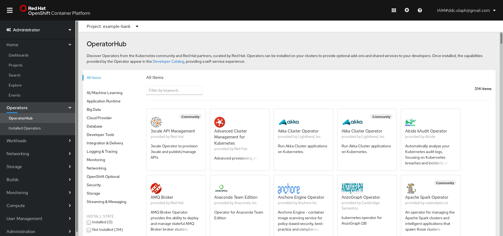
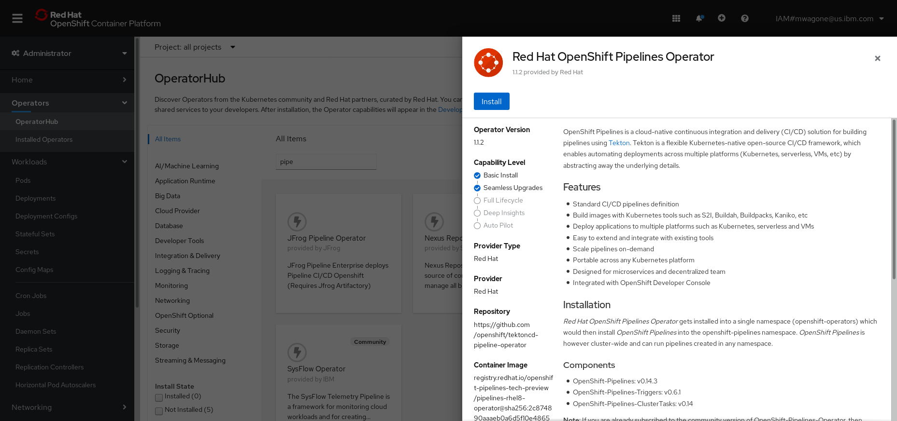
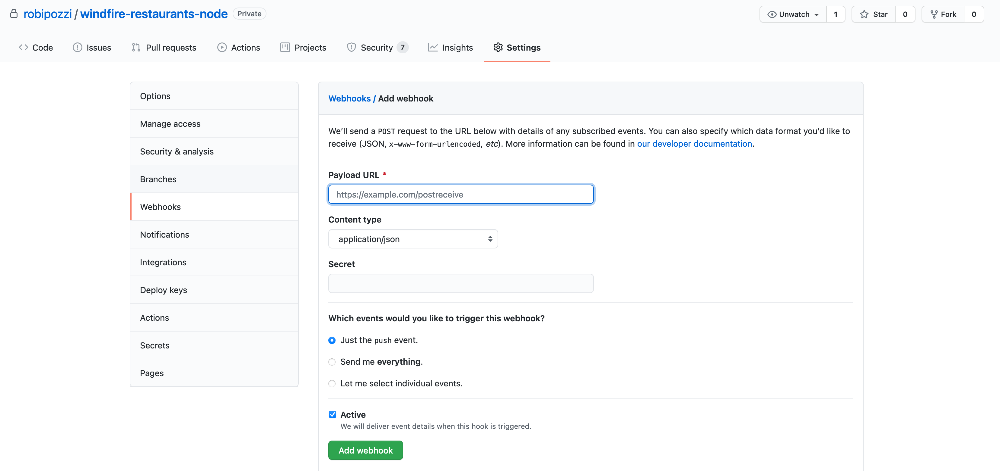
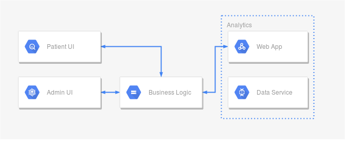

# Tekton and OpenShift Pipelines
- [Introduction](#introduction)
- [Before you start](#before-you-start)
    - [Install OpenShift Pipelines](#install-openshift-pipelines)
    - [Configure Service Account](#configure-service-account)
- [OpenShift Pipelines examples](#openshift-pipelines-examples)
    - [Vote Application Pipeline](#vote-application-pipeline)
    - [Windfire Restaurants Pipeline](#windfire-restaurants-pipeline)
    - [Example Health Pipeline](#example-health-pipeline)
- [License](#License)

## Introduction
Red Hat OpenShift Pipelines is a cloud-native continuous integration and delivery (CI/CD) solution for building pipelines using [Tekton](https://tekton.dev/).

Tekton is a flexible Kubernetes-native open-source CI/CD framework, which enables automating deployments across multiple platforms (Kubernetes, serverless, VMs, etc) by abstracting away the underlying details.

Refer to Red Hat OpenShift official documentation (https://docs.openshift.com/container-platform/4.6/pipelines/creating-applications-with-cicd-pipelines.html) for more info about OpenShift Pipelines.

## Before you start
Before experimenting with OpenShift Pipelines, you need to take 2 preparatory steps:
1. [Install OpenShift Pipelines](#install-openShift-pipelines) on your OpenShift cluster (pretty obvious !!!).
2. [Create a Service Account](#configure-service-account) and configure it appropriately.

### Install OpenShift Pipelines
Go to OpenShift web console, select **Operators** -> **Operators Hub** from the navigation menu on the left of your OpenShift web console and then search for the OpenShift Pipelines Operator.

Click on the tile and then the subsequent Install button.

Keep the default settings on the Create Operator Subscription page and click Subscribe.

### Configure Service Account
To make sure the pipeline has the appropriate permissions to store images in the local OpenShift registry, we need to create a service account. We'll call it **pipeline**.

Running **[create-serviceaccount.sh](create-serviceaccount.sh)** script does everything that is needed:
- it sets context to the OpenShift project selected (the project is automatically created if it does not pre-exist)
- it creates a **pipeline** Service Account
- it adds a **privileged** Security Context Constraint to pipeline account
- it adds an **edit** Role to pipeline account
- it creates a Secret for GitHub credentials, annotates with **"tekton.dev/git-0=https://github.com"** and links it to **pipeline** Service Account
- it creates a Secret for Quay credentials, annotates with **"tekton.dev/docker-0=quay.io"** and links it to **pipeline** Service Account
- it links Secret for Quay credentials to **default** Service Account for pull

## OpenShift Pipelines examples
Several examples are provided to experiment with OpenShift Pipelines
- [Vote Application Pipeline](#vote-application-pipeline)
- [Windfire Restaurants Pipeline](#windfire-restaurants-pipeline)
- [Example Health Pipeline](#example-health-pipeline)

### Vote Application Pipeline
This example is taken from Red Hat OpenShift official documentation (https://docs.openshift.com/container-platform/4.6/pipelines/creating-applications-with-cicd-pipelines.html) and uses a simple application consisting of the following 2 components:
- A front-end interface, **vote-ui**, with the source code in the [ui-repo](https://github.com/robipozzi/vote-ui) Git repository.
- A back-end interface, **vote-api**, with the source code in the [api-repo](https://github.com/robipozzi/vote-api) Git repository.

Run **[create-pipeline.sh](1-vote/create-pipeline.sh)** script to create the Pipeline and all the needed Tasks and PipelineResources in your OpenShift cluster; the script does the following:

1. It uses **[pvc.yaml](1-vote/pvc.yaml)** file to create:
    - *vote-pvc* PersistentVolumeClaim, which provides data storage and binds it to the Workspace. This PersistentVolumeClaim provides the volumes or filesystem required for the Pipeline execution.

    **WARNING:** ensure the PersistentVolumeClaim is bound before trying to run the pipeline.
2. It uses **[vote-resources.yaml](1-vote/vote-resources.yaml)** file to create:
    - *vote-api-git* PipelineResources, which configures the GitHub repository from which *vote-api* application component source code is taken
    - *vote-api-image* PipelineResources, which defines the container image that gets created within OpenShift internal registry
    - *vote-ui-git* PipelineResources, which configures the GitHub repository from which *vote-ui* application component source code is taken
    - *vote-ui-image* PipelineResources, which defines the container image that gets created within OpenShift internal registry
3. It uses **[vote-pipeline.yaml](1-vote/vote-pipeline.yaml)** file to create:
    - *apply-manifests* Task, which scans the directory in the source code repository containing yaml manifests and uses **oc apply** command to create all the Kubernetes objects described in those yaml manifests.
    - *update-deployment* Task, which patches the deployment
    - *vote-build-and-deploy* Pipeline, which defines all the steps to build and deploy the *vote* application components

The Pipeline performs the following tasks for the back-end application *vote*:
- It runs *git-clone* ClusterTask to clone the source code of the application from the Git repository by referring to the git-url and git-revision parameters.
- It runs *buildah* ClusterTask to build the container image and push it to the internal image registry by referring to the image parameter.
- It runs *apply-manifests* custom created Task to deploy the new image on OpenShift Container Platform

Once you have created the Pipeline, you can go to OpenShift web console and start it, entering the appopriate parameters; alternatively you can also launch:
- **[run-vote-api-pipeline.sh](1-vote/run-vote-api-pipeline.sh)** script which uses **[vote-api-pipelinerun.yaml](1-vote/vote-api-pipelinerun.yaml)** file to run the Pipeline with the following meaningful default parameters:
    - *git-url*: https://github.com/robipozzi/vote-api
    - *IMAGE*: image-registry.openshift-image-registry.svc:5000/windfire/vote-api:1.0
- **[run-vote-ui-pipeline.sh](1-vote/run-vote-ui-pipeline.sh)** script which uses **[vote-ui-pipelinerun.yaml](1-vote/vote-ui-pipelinerun.yaml)** file to run the Pipeline with the following meaningful default parameters:
    - *git-url*: https://github.com/robipozzi/vote-ui
    - *IMAGE*: image-registry.openshift-image-registry.svc:5000/windfire/vote-ui:1.0

Run **[delete-pipeline.sh](1-vote/delete-pipeline.sh)** script to delete Pipeline, Tasks and PipelineResources at once.

### Windfire Restaurants Pipeline
- [Pipeline configuration](#pipeline-configuration)
- [Trigger Pipeline execution](#trigger-pipeline-execution)

#### Pipeline configuration
This example uses the backend of *Windfire Restaurants* application, which returns a list of restaurants; the source code is available at this GitHub repo: https://github.com/robipozzi/windfire-restaurants-node .

Run **[create-pipeline.sh](2-windfire-restaurants/create-pipeline.sh)** script to create the Pipeline and all the needed PipelineResources in your OpenShift cluster; the script does the following:

1. It uses **[pvc.yaml](2-windfire-restaurants/pvc.yaml)** file to create:
    - *windfire-restaurants-pvc* PersistentVolumeClaim, which provides data storage and binds it to the Workspace. This PersistentVolumeClaim provides the volumes or filesystem required for the Pipeline execution.

    **WARNING:** ensure the PersistentVolumeClaim is bound before trying to run the pipeline.
2. It uses **[windfire-restaurants-backend-pipeline.yaml](2-windfire-restaurants/windfire-restaurants-backend-pipeline.yaml)** file to create:
    - *windfire-restaurants-node-git* PipelineResources, which configures the GitHub repository from which *windfire-restaurants* application source code is taken
    - *windfire-restaurants-node-image* PipelineResources, which defines the container image that gets created within OpenShift internal registry
    - *windfire-restaurants-backend* Pipeline, which defines all the steps to build and deploy the *vote* application components

The Pipeline performs the following tasks for the back-end application *vote*:
- Clones the source code of the application from the Git repository by referring to the git-url and git-revision parameters.
- Builds the container image and pushes it to container registry using *buildah* ClusterTask.
- Deploy the image to OpenShift wrapping an *oc new-app* command using *openshift-client* ClusterTask.
- Expose a Route wrapping an *oc expose* command using *openshift-client* ClusterTask.

Once you have created the Pipeline, you can go to OpenShift web console and start it; alternatively you can also launch **[run-pipeline.sh](2-windfire-restaurants/run-pipeline.sh)** script which uses **[windfire-restaurants-backend-pipelinerun.yaml](2-windfire-restaurants/windfire-restaurants-backend-pipelinerun.yaml)** file to run the Pipeline using the previously created PipelineResources:
    - *windfire-restaurants-node-git*: https://github.com/robipozzi/windfire-restaurants-node
    - *windfire-restaurants-node-image*: image-registry.openshift-image-registry.svc:5000/windfire/vote-api:2.0

Run **[delete-pipeline.sh](2-windfire-restaurants/delete-pipeline.sh)** script to delete Pipeline and PipelineResources at once.

#### Trigger Pipeline execution
OpenShift Pipelines can be invoked by human intervention or triggered and automatically executed by events, e.g.: a push to GitHub repository.

Tekton framework encompasses 4 Custom Resource Definitions to enable pipeline execution triggering: **TriggerBinding**, **TriggerTemplate**, **Trigger**, and **EventListener** resources.

Run the provided **[create-trigger.sh](2-windfire-restaurants/create-trigger.sh)** script to create all the resources needed to intercept events and trigger the appropriate pipeline execution; the script sequentially does the following:
- create a **TriggerBinding** resource, using **[trigger-binding.yaml](2-windfire-restaurants/trigger-binding.yaml)** file.
- create a **TriggerTemplate** resource, using **[trigger-template.yaml](2-windfire-restaurants/trigger-template.yaml)** file.
- create a **Trigger** resource, using **[trigger.yaml](2-windfire-restaurants/trigger.yaml)** file.
- create an **EventListener** resource, using **[event-listener.yaml](2-windfire-restaurants/event-listener.yaml)** file.
- expose EventListener Service as a Route, in order to be callable by Webhooks.

To actually trigger the whole chain when a push event occurs on a GitHub repository, a Webhook needs to be properly configured on GitHub; follow these instructions to create it:

1. Get the Webhook URL, issuing the following command: *echo "URL: $(oc get route el-windfire-restaurants-backend --template='http://{{.spec.host}}')"*
2. Open https://github.com/robipozzi/windfire-restaurants-node Git repository
3. Click Settings → Webhooks → Add Webhook
    - Enter the Webhook URL from step 1 in Payload URL field
    - Select application/json for the Content type
    - Ensure that the *Just the push event* is selected
    - Select Active
    - Click Add Webhook

Refer to the following picture as an example of what to do:

Webhooks are HTTP POST messages that are received by the EventListener whenever a configured event occurs in GitHub repository; EventListener refers to Trigger resource which, in turns, simply refers and binds together TriggerBinding and TriggerTemplate resources.

The event payload is mapped to TriggerBinding that extracts the needed information from the event occuring, while TriggerTemplate defines a PipelineRun resource that processes the event, running a Pipeline, leading to the build and deployment of the application with all the needed Kubernetes resources.

Run **[delete-trigger.sh](2-windfire-restaurants/delete-trigger.sh)** script to delete all the trigger related resources.

### Example Health Pipeline
Example Health is a demo app made of five different images all deployed into a single Red Hat OpenShift.

**Full credit goes to Mostafa Abdelaleem (original code is at https://github.com/Mostafa-Abdelaleem/example-health-pipeline)**

This pipeline uses several methods for deploying images in OpenShift.  
- The Patent UI image is constructed from node.js code via OpenShift's Source-to-image functionality; 
- the Admin UI likewise from a php repository. 
- The two analytics images are also build, but rather via Dockerfiles.  
- The JEE business logic image is deployed directly from Docker Hub.

## License
This code pattern is licensed under the Apache License, Version 2. Separate third-party code objects invoked within this code pattern are licensed by their respective providers pursuant to their own separate licenses. Contributions are subject to the [Developer Certificate of Origin, Version 1.1](https://developercertificate.org/) and the [Apache License, Version 2](https://www.apache.org/licenses/LICENSE-2.0.txt).

[Apache License FAQ](https://www.apache.org/foundation/license-faq.html#WhatDoesItMEAN)